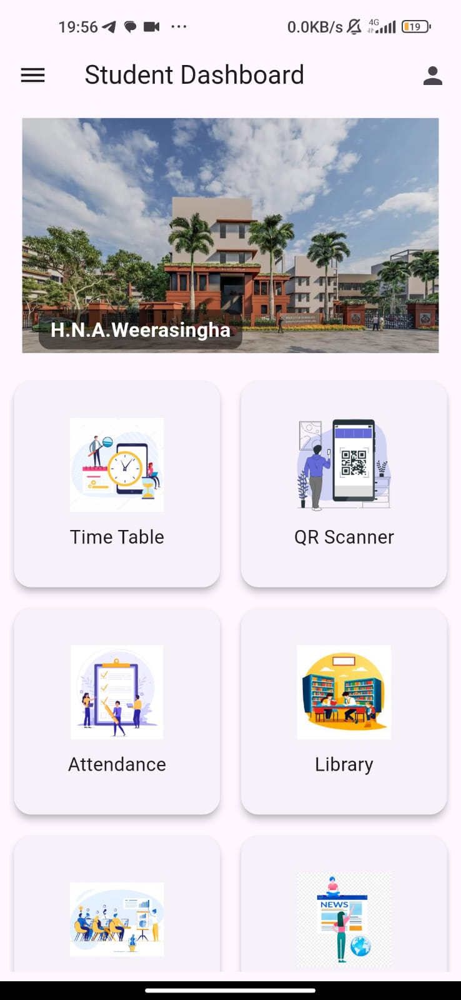
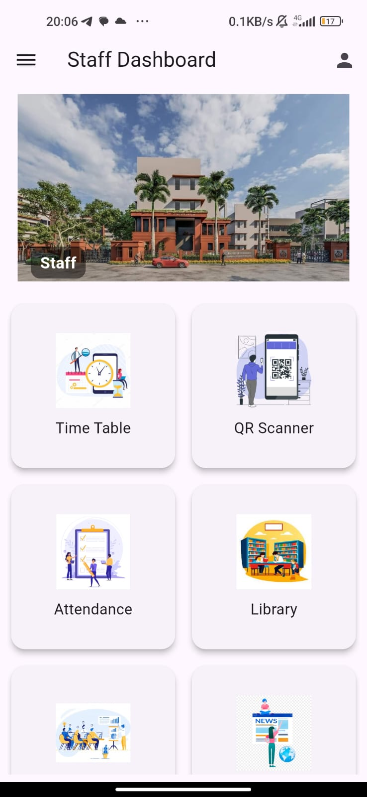
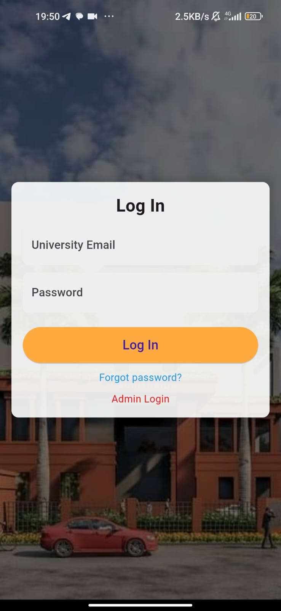

# Faculty Dashboard Application 🎓

A comprehensive, cross-platform mobile application built with **Flutter** and **Firebase** designed to bridge the communication gap between students, lecturers, and university administration.

## 🌟 Key Features

### For Students
* **Secure Login:** Access restricted to verified university email addresses.
* **Timetable View:** Real-time access to daily and weekly lecture schedules.
* **Smart Attendance:** Integrated system to mark attendance using University ID.
* **Library Integration:** Direct access links to the University Library website.
* **Real-time Notifications:** Instant push notifications for class changes or announcements.

### For Lecturers
* **Management Dashboard:** Tools to send mass notifications to students.
* **Profile Management:** Pre-filled profiles with editable fields for personalization.
* **Admin Control:** Dedicated dashboard to monitor user activity and manage system data.

## 🛠 Tech Stack
* **Frontend:** Flutter & Dart
* **Backend/Database:** Firebase (Firestore, Authentication, Cloud Messaging)
* **UI/UX:** Custom-designed user-friendly interface with interactive popup alerts.

## 📸 Screenshots
| Student Dashboard | Lecturer Dashboard | Login View |
|---|---|---|
|  |  |  |

## 🚀 Getting Started

1.  **Clone the repository:**
    ```bash
    git clone [https://github.com/yasithinosh/fotsd.git]
    ```
2.  **Install dependencies:**
    ```bash
    flutter pub get
    ```
3.  **Firebase Setup:**
    * Create a project on the Firebase Console.
    * Add your `google-services.json` (Android) and `GoogleService-Info.plist` (iOS).
    * Enable Email/Password Authentication.
4.  **Run the app:**
    ```bash
    flutter run
    ```

## 👥 Contributors
* **Yasith Inosh** - Lead Developer 
* Oshadha Danajaya
*Chamil
*Vihini
